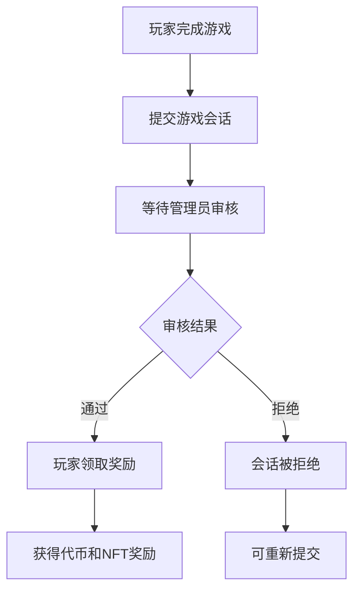

# 🎮 GameRewards 增强功能使用指南

## 📋 概述

GameRewards 合约现在支持玩家自主提交游戏会话和领取奖励的去中心化机制。这个系统包含三个主要流程：

1. **玩家提交** - 玩家自主提交游戏结果
2. **管理员审核** - 管理员验证游戏结果的真实性
3. **玩家领取** - 审核通过后玩家自行领取奖励

## 🔄 完整流程



## 🎯 主要功能

### 1. 玩家提交游戏会话

```javascript
// 提交单个游戏会话
await gameRewards.connect(player).submitPlayerSession(
  finalRank,        // 最终排名 (1-based)
  maxMass,          // 最大体积
  survivalTime,     // 存活时间（秒）
  killCount,        // 击杀数量
  sessionEndTime,   // 游戏结束时间
  sessionId         // 唯一会话ID
);
```

**安全限制：**
- 每日最多提交 20 个会话
- 会话结束时间不能是未来时间
- 会话结束时间不能超过 24 小时前
- 会话ID必须唯一

### 2. 管理员审核机制

```javascript
// 单个会话审核
await gameRewards.connect(admin).verifyPlayerSession(sessionId, true); // 通过
await gameRewards.connect(admin).verifyPlayerSession(sessionId, false); // 拒绝

// 批量审核
await gameRewards.connect(admin).verifyPlayerSessionsBatch(
  [sessionId1, sessionId2, sessionId3],
  [true, false, true]  // 对应的审核结果
);
```

### 3. 玩家自主领取奖励

```javascript
// 领取单个会话奖励
await gameRewards.connect(player).claimReward(sessionId);

// 批量领取多个会话奖励
await gameRewards.connect(player).claimRewardsBatch([sessionId1, sessionId2]);
```

**领取条件：**
- 会话必须已审核通过
- 会话尚未领取过奖励
- 会话未过期（默认7天有效期）
- 只有会话提交者可以领取

## 📊 查询功能

### 玩家查询

```javascript
// 获取玩家提交的所有会话ID
const submittedSessions = await gameRewards.getPlayerSubmittedSessions(playerAddress);

// 获取可领取奖励的会话ID
const claimableSessions = await gameRewards.getPlayerClaimableSessions(playerAddress);

// 获取玩家会话统计
const [submitted, verified, claimed, claimable] = await gameRewards.getPlayerSessionStats(playerAddress);

// 获取特定会话详情
const sessionDetails = await gameRewards.getSessionDetails(sessionId);
```

### 管理员查询

```javascript
// 获取待审核会话列表
const pendingSessions = await gameRewards.getPendingVerificationSessions(0, 50);

// 获取系统扩展统计
const [totalSubmitted, totalVerified, pendingCount, expiredCount] = 
  await gameRewards.getExtendedSystemStats();
```

## ⚙️ 管理员配置

```javascript
// 设置会话有效期（1-30天）
await gameRewards.connect(admin).setSessionValidityPeriod(7 * 24 * 3600); // 7天

// 设置每日最大提交数量
await gameRewards.connect(admin).setMaxSessionsPerDay(20);

// 清理过期会话
await gameRewards.connect(admin).cleanupExpiredSessions(50);
```

## 🎁 奖励计算

奖励计算公式保持不变：
```
总奖励 = 基础奖励 + 排名奖励 + 击杀奖励 + 存活奖励 + 体积奖励
```

**特殊NFT奖励条件：**
- 第一名且击杀数 ≥ 5
- 存活时间 ≥ 10分钟且体积 ≥ 5000

## 📝 事件监听

```javascript
// 监听玩家提交事件
gameRewards.on("PlayerSessionSubmitted", (sessionId, player, finalRank, maxMass, survivalTime, killCount) => {
  console.log(`玩家 ${player} 提交了会话 ${sessionId}`);
});

// 监听审核事件
gameRewards.on("SessionVerified", (sessionId, verifier, approved) => {
  console.log(`会话 ${sessionId} 审核结果: ${approved ? '通过' : '拒绝'}`);
});

// 监听奖励领取事件
gameRewards.on("RewardClaimed", (sessionId, player, tokenAmount, claimedAt) => {
  console.log(`玩家 ${player} 领取了 ${tokenAmount} BUB 代币`);
});
```

## 🔒 安全特性

### 防作弊机制
- **会话ID唯一性** - 防止重复提交
- **时间验证** - 防止未来时间和过期会话
- **每日限制** - 防止垃圾提交
- **权限控制** - 只有授权管理员可以审核
- **所有权验证** - 只有会话提交者可以领取奖励

### 重入攻击保护
- 所有外部调用函数都使用 `nonReentrant` 修饰符
- 状态更新在外部调用之前完成

### 访问控制
- 使用 OpenZeppelin AccessControl 进行权限管理
- 分离的角色权限：管理员、审核员等

## 💡 最佳实践

### 对于玩家
1. **及时提交** - 游戏结束后尽快提交会话
2. **准确数据** - 确保提交的数据准确无误
3. **定期检查** - 定期查看审核状态和可领取奖励
4. **批量领取** - 积累多个审核通过的会话后批量领取

### 对于管理员
1. **及时审核** - 定期审核待处理的会话
2. **批量操作** - 使用批量审核提高效率
3. **定期清理** - 清理过期会话保持系统整洁
4. **监控统计** - 关注系统统计数据发现异常

### 对于开发者
1. **错误处理** - 妥善处理各种异常情况
2. **事件监听** - 监听相关事件更新UI状态
3. **用户体验** - 提供清晰的状态提示和操作指引
4. **性能优化** - 合理使用批量操作减少gas消耗

## 🚀 集成示例

```javascript
// 完整的游戏结束后流程
async function handleGameEnd(gameResult) {
  try {
    // 1. 生成唯一会话ID
    const sessionId = ethers.keccak256(ethers.toUtf8Bytes(`${gameResult.gameId}-${Date.now()}`));
    
    // 2. 提交游戏会话
    const tx = await gameRewards.submitPlayerSession(
      gameResult.finalRank,
      gameResult.maxMass,
      gameResult.survivalTime,
      gameResult.killCount,
      Math.floor(Date.now() / 1000),
      sessionId
    );
    
    await tx.wait();
    console.log("游戏会话提交成功，等待审核...");
    
    // 3. 监听审核结果
    gameRewards.once("SessionVerified", async (verifiedSessionId, verifier, approved) => {
      if (verifiedSessionId === sessionId && approved) {
        console.log("会话审核通过，可以领取奖励！");
        
        // 4. 自动领取奖励
        const claimTx = await gameRewards.claimReward(sessionId);
        await claimTx.wait();
        console.log("奖励领取成功！");
      }
    });
    
  } catch (error) {
    console.error("处理游戏结果失败:", error);
  }
}
```

## 📞 技术支持

如有问题或建议，请联系开发团队或查看合约源码中的详细注释。

---

**⚠️ 重要提醒**: 
- 确保在生产环境中进行充分的安全审计
- 建议使用多重签名钱包管理管理员权限
- 定期备份重要的会话数据
